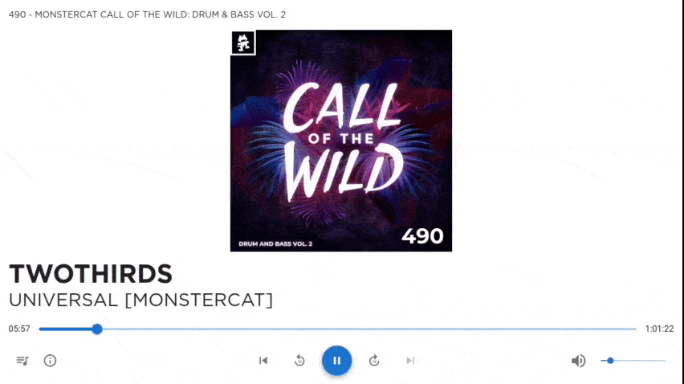

# Tracklist Player

An audio player application which is designed for playing mixes. It displays the currently playing track based on the timestamps in a tracklist.



## Downloading
Head to the [latest release](https://github.com/tonkku107/tracklist-player/releases/latest) page and download the appropriate file for your operating system under assets.\
(.exe for windows, .dmg for macos, .appimage or .tar.xz for linux)

## Usage
1. Load mixes into the queue. You can use:
    - Local files
    - MSS or COTW RSS feeds
        - Depending on your location these may contain ads. The application will do its best to figure out when the actual mix starts. (If it fails please make an issue and include the debug information from the ⓘ button)
2. Import the tracklist
    - This is done automatically for the RSS feeds and the tracklist will be hidden to avoid spoiling the mix. You may still edit the tracklist if you want.
3. Start playing and enjoy the show

## Tracklist formats
Two tracklist formats are currently supported\
Silk Showcase style:
```
Silk Exclusive:
1. Artist - Title (Version) [Label] [00:00]
```
Call of the Wild style:
```
00:00 Artist - Title (Version) [Label]
```

## Font
If you have the "Gotham" fonts installed on your system, the track artist and title will be displayed using it to match Monstercat's style. The fonts are not included with the application.

## Feedback and bug reports
If you encounter any bugs, you can create an [issue](https://github.com/tonkku107/tracklist-player/issues). Be sure to include as much useful information as possible like the version and operating system.\
You can send feature suggestions and ideas in [discussions](https://github.com/tonkku107/tracklist-player/discussions).\
Contributions via [pull requests](https://github.com/tonkku107/tracklist-player/pulls) are also accepted!
